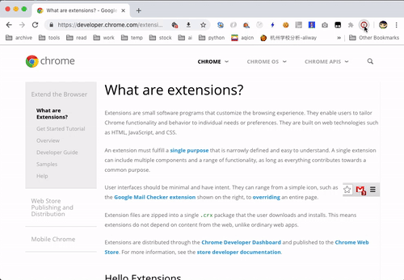

# Snapshot as HTML (v0.0.2)
A chrome extension save webpage snapshot as html
一个将网页渲染结果保存为 HTML 代码的 chrome 插件

When you need a large number of webpages to do some AI thing, it must help a lot!

### How it works?
1. inline all same origin external styles
2. grab the rendered webpage code
3. remove all scripts
4. remove all iframe srcs
5. normalize all urls

